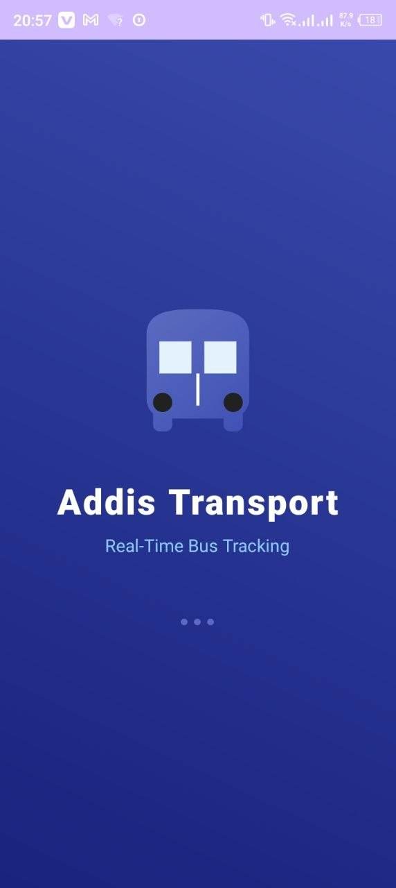
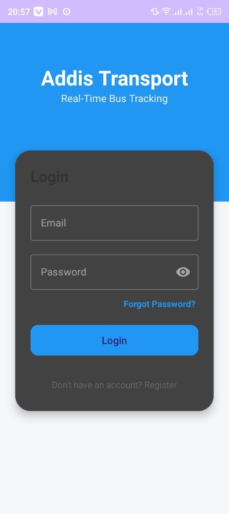
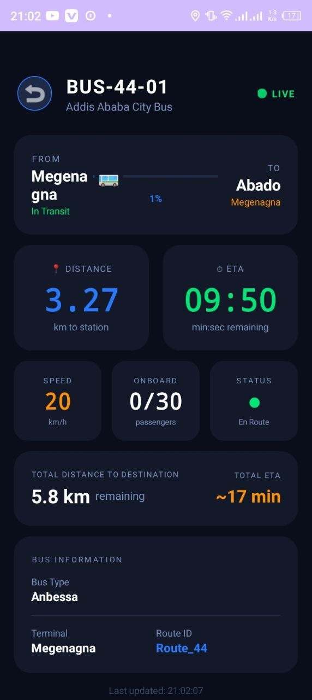
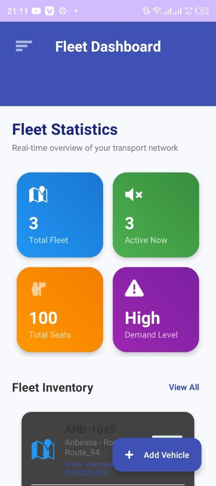
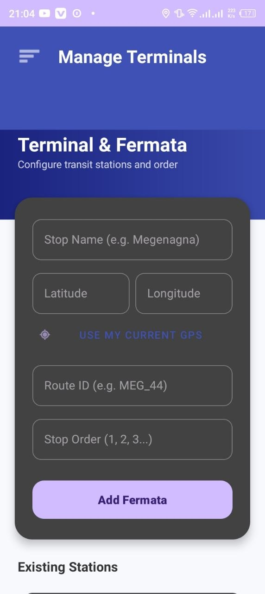

<div align="center">
  
  <br/>
  <h1>🚍 Addis Transport Tracking System</h1>
  <p><strong>A Next-Generation Real-Time Urban Mobility & Fleet Management Solution for Addis Ababa.</strong></p>
  
  []()
  []()
  []()
  []()
</div>

<hr/>

## ✨ Project Overview

Addis Transport is a comprehensive, dual-platform ecosystem designed to revolutionize public commuting in Addis Ababa. It bridges the gap between daily commuters and transit authorities by providing accurate, real-time bus tracking and a powerful centralized management dashboard.

<div align="center">
  
| 📱 Passenger App (Android/Kotlin) | 💻 Admin Dashboard (React.js) |
| :--- | :--- |
| **Live Map Tracking:** Watch buses move in real-time. | **Enterprise Fleet Control:** Add, update, or remove buses. |
| **Smart Trip Planner:** Find the fastest routes to destinations. | **Terminal Config:** Geolocation-based route ordering. |
| **Instant ETA:** Get accurate arrival times based on speed. | **Command Center:** Monitor driver info & live capacity. |
| **Alerts & News:** Receive push notifications for delays. | **Broadcast Hub:** Send system-wide alerts instantly. |

</div>

---

## 🚀 Today's Major Updates (May 17, 2026)

*   📧 **Secure Email OTP Pipeline**: Re-implemented the OTP email delivery using standard **JavaMail SSL (Port 465)**, fixing the "Could not convert socket to TLS" error. Enabled secure end-to-end delivery of 6-digit codes to user inboxes.
*   🔒 **Secure OTP Flow**: Removed the on-screen helper code from the verification screen to ensure the security flow is authentic and the code is obtained exclusively from the user's inbox.
*   👥 **Admin User List Fixed**: Removed `limit(2)` restriction in the admin dashboard query to ensure **all registered users** show up in real-time.
*   🗑️ **Robust User Deletion**: Reorganized React hooks and fully repaired the 🗑️ **Delete User** action with prompt confirmation and direct Firestore synchronization. Secured administrator profiles from accidental deletion using case-insensitive check guards.

---

## 🛠️ Architecture & Tech Stack

### 📱 1. Mobile Passenger App (Native Android)
Built for speed, reliability, and smooth animations even on lower-end devices.
*   **Kotlin**: Google's official, highly-secure language preventing common crashes.
*   **MVVM Architecture**: Separates UI from logic, ensuring the app never crashes during screen rotations.
*   **Coroutines**: Handles heavy background tasks (like GPS polling) without freezing the UI.
*   **Google Maps SDK**: Renders custom dynamic markers seamlessly.

### 🌐 2. Web Admin Dashboard (React.js)
A robust command center built to handle thousands of live data points.
*   **React.js**: Component-based architecture for extremely fast map and data rendering without page reloads.
*   **Tailwind CSS**: Utility-first styling for a beautiful, responsive, "Glassmorphism" enterprise aesthetic.
*   **Context API**: Manages complex global states (like authenticated admin profiles).

### ☁️ 3. Shared Backend
*   **Firebase Firestore (NoSQL)**: Ultra-fast real-time database syncing across Web and Mobile simultaneously.
*   **Firebase Auth**: Secure, role-based access control.

---

## 📂 Project Structure & Deep Dive

### The Android App (`app/src/main/`)
```text
app/src/main/
├── java/.../transporttrackingsystem/
│   ├── 📺 activities/  ➔ UI logic. Controls what happens when users interact with screens.
│   ├── 🔌 adapters/    ➔ The bridge connecting raw Firestore data to visual lists (RecyclerViews).
│   ├── 📦 models/      ➔ Data blueprints (e.g., shaping how a 'Bus' looks in code).
│   ├── 🌐 network/     ➔ Secure API requests and Firebase listeners.
│   ├── 🛠️ utils/       ➔ Reusable helpers (time formatting, distance calculation).
│   └── 🧠 viewmodels/  ➔ State management. Keeps UI data safe during interruptions.
└── res/                ➔ Visuals! XML layouts, icons, and Material Design themes.
```

### The React Dashboard (`admin-dashboard-web/src/`)
```text
admin-dashboard-web/src/
├── 🖼️ assets/          ➔ Static files (Logos, premium fonts).
├── 🧩 components/      ➔ Reusable UI blocks (Sidebars, metric cards, map overlays).
├── 🌍 context/         ➔ Global state managers (User sessions).
├── 🪝 hooks/           ➔ Custom logic (e.g., checking if an Admin is logged in).
├── 📄 pages/           ➔ Full-screen dashboard views (Fleet Manager, Complaints).
└── 🔧 utils/           ➔ Math and sorting algorithms for large data tables.
```

---

## ⚙️ Setup & Installation

### Running the Web Dashboard
```bash
cd admin-dashboard-web
npm install
npm run dev
```
*(Runs securely on localhost with hot-module reloading)*

### Running the Android App
1. Open the root folder (`TransportTrackingSystem`) in **Android Studio**.
2. Ensure your `google-services.json` is placed in the `app/` directory.
3. Click **Sync Project with Gradle Files**.
4. Press **Run** (Shift+F10) on an emulator or physical device.

---

## 📸 Visual Gallery

### 🚶 User Application Flow
| Welcome | Login | Live Map Tracking |
| :---: | :---: | :---: |
|  |  |  |

### 👨‍💼 Admin Command Center
| Main Dashboard | Fleet Statistics | Route Configuration |
| :---: | :---: | :---: |
|  |  |  |

<hr/>

<div align="center">
  <b>Developed for Addis Ababa Transport Management.</b><br>
  <i>Empowering commuters with data, one ride at a time.</i>
</div>
