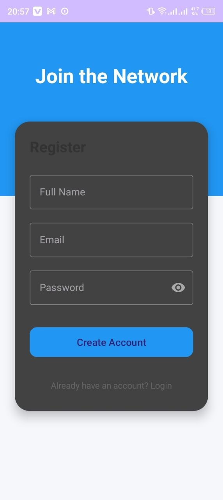
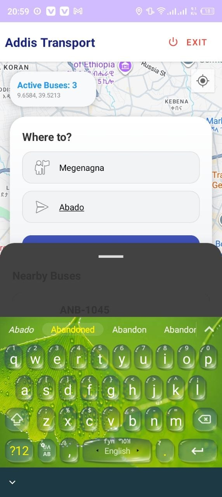
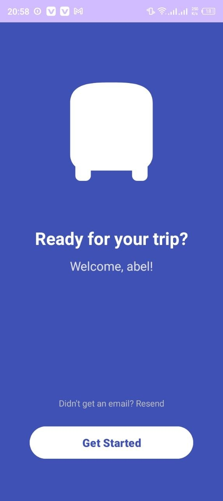
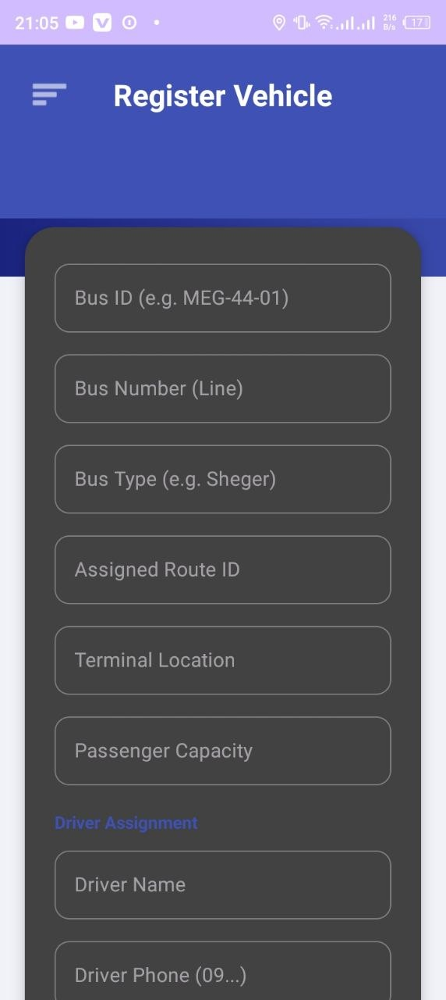
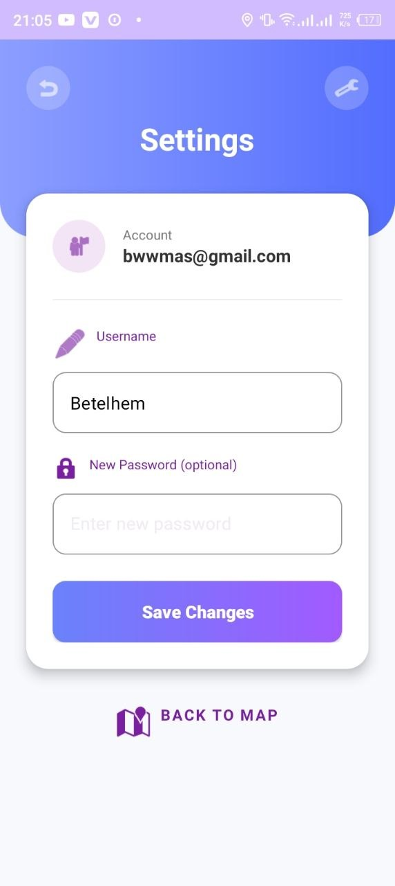
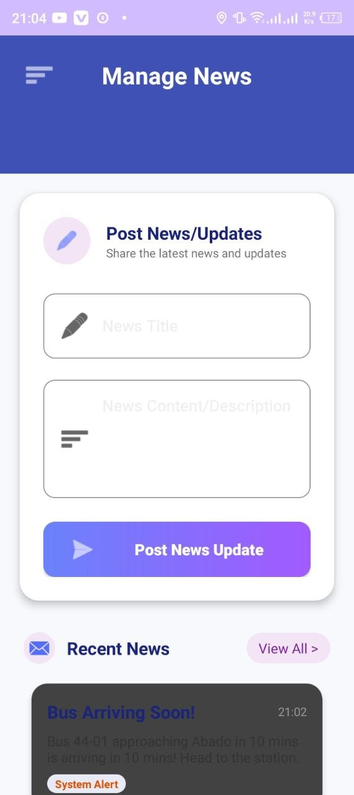

# Addis Transport - Transport Tracking System 🚍

Addis Transport is a comprehensive real-time bus tracking and management suite designed to improve the commuting experience in Addis Ababa. It features a native Android application for passengers and a premium React-based Web Dashboard for fleet administrators.

## 🌟 Today's Major Updates (May 16, 2026)
*   **Premium Admin Gateway**: Redesigned the Web Login into a high-end, two-column enterprise interface with real-time fleet telemetry.
*   **Full Mobile Responsiveness**: Implemented a slide-over navigation system and centered administrative forms for perfect mobile dashboard management.
*   **Live Data Integration**: Connected the login screen to live Firestore metrics to show active vehicle counts instantly.
*   **Optimized Workflows**: Synchronized notification badges with database states for accurate real-time alerting.

## 🚀 Key Modules

### 📱 Android Application (Passengers)
*   **Live Map Tracking**: View real-time locations of buses on Google Maps.
*   **Trip Planner**: Find the fastest routes from your current station to your destination.
*   **Real-time Alerts**: Get notified about traffic congestion or delays.
*   **News & Updates**: Stay informed with the latest transport system announcements.

### 💻 Web Dashboard (Administrators)
*   **Enterprise Fleet Control**: Add, update, or remove buses with a high-density management interface.
*   **Terminal & Route Configuration**: Geolocation-based station setup and route ordering.
*   **Live Command Center**: Monitor fleet status, driver information, and passenger capacity in real-time.
*   **System Notifications**: Broadcast news and alerts to all connected mobile users.

## 🛠 Tech Stack

*   **Mobile**: Kotlin, XML, Google Maps SDK, Firebase.
*   **Web**: React.js, Vite, Tailwind CSS, Lucide Icons.
*   **Backend**: Firebase Firestore, Authentication, and Cloud Functions.
*   **Design**: Modern Enterprise Aesthetic (Glassmorphism, Vibrant Mesh Gradients).

## 📂 Project Structure

```text
TransportTrackingSystem/
├── app/                      # Native Android Application (Kotlin)
├── admin-dashboard-web/      # Enterprise Web Dashboard (React)
│   ├── src/
│   │   ├── components/       # Premium UI Modules (AdminLogin, Dashboard)
│   │   ├── firebase.js       # Real-time DB Configuration
│   │   └── App.jsx           # Responsive Routing & State Logic
├── Screenshots/              # Visual Documentation
└── README.md                 # Project Overview
```

## ⚙️ Setup & Installation

### Web Dashboard
```bash
cd admin-dashboard-web
npm install
npm run dev
```

### Android App
1.  Open the root folder in **Android Studio**.
2.  Add your `google-services.json` to the `app/` folder.
3.  Sync Gradle and Run.

## 📸 Screenshots

### User Application Flow
| Splash & Welcome | Registration & Login | Map & Tracking |
| :---: | :---: | :---: |
|  |  |  |
|  |  |  |

### Admin Management Flow
| Dashboard | Fleet Stats | Terminals & Routes |
| :---: | :---: | :---: |
|  |  |  |
|  |  |  |

---
*Developed for Addis Ababa Transport Management.*
