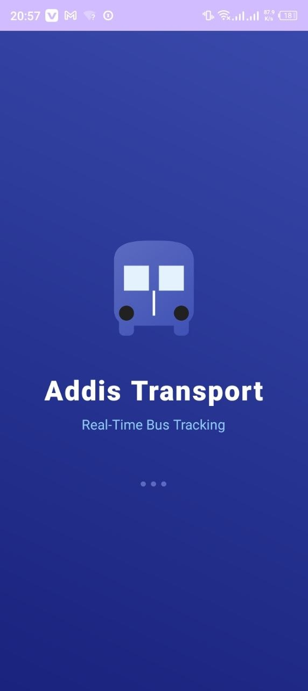
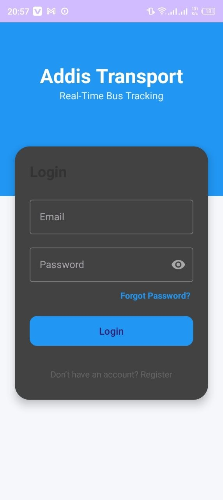
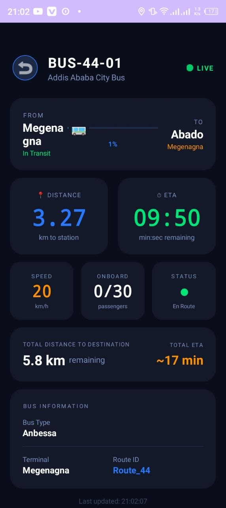
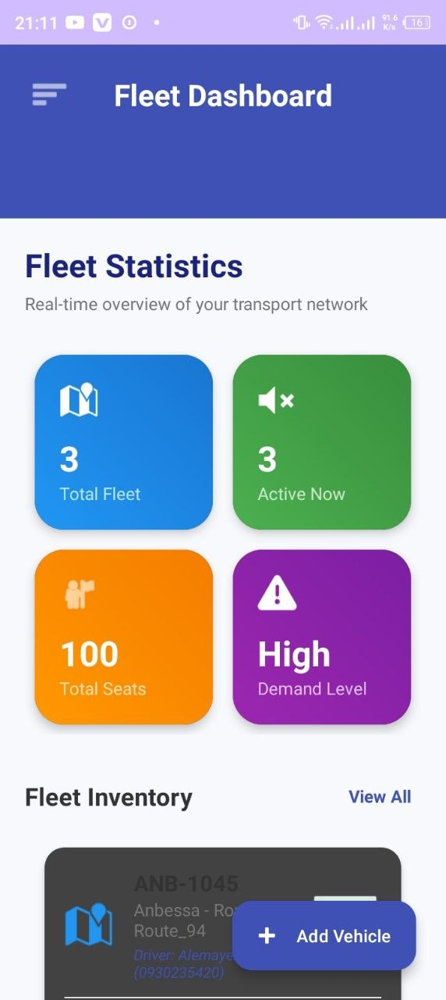
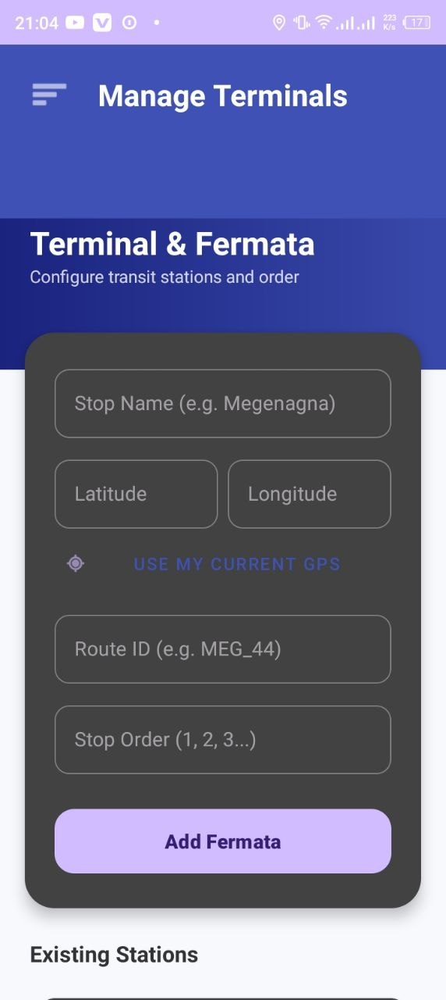

<div align="center">
  
  <br/>
  <h1>🚍 Addis Transport Tracking System</h1>
  <p><strong>A Next-Generation Real-Time Urban Mobility & Fleet Management Solution for Addis Ababa.</strong></p>
  
  []()
  []()
  []()
  []()
  []()
</div>

<hr/>

## 🎯 Problem & Solution

**The Problem:** Commuters in Addis Ababa often face unpredictable bus schedules, long wait times, and a lack of real-time transit information. Furthermore, public transport administrators lack a unified system to track fleet movements, manage delays, and communicate with users dynamically.

**The Solution:** The **Addis Transport Tracking System** bridges the gap between daily commuters and transit authorities by providing an interactive ecosystem. It features a native Android app for passengers to track buses in real-time with multi-language support, and a high-performance React web dashboard for admins to oversee fleet operations, manage routes, and analyze system load.

---

## 🌟 Key Features & Recent Additions

*   🗺️ **Live Real-Time Map Integration**: 
    *   **Android App**: Uses Google Maps SDK for smooth native bus tracking.
    *   **Web Dashboard**: Integrated **Leaflet** maps dynamically via CDN to show live vehicle movement natively in React.
*   🌍 **Dynamic Multi-Language Support**: Instantly switch between English, አማርኛ (Amharic), Afaan Oromoo, ትግርኛ (Tigrinya), and Somali without restarting the app using `AppCompatDelegate.setApplicationLocales`.
*   👁️ **Accessibility Controls (Dark Mode & Font Scaling)**: 
    *   Toggle **Dark/Light Theme** dynamically across the UI.
    *   **Interactive Font Size Slider** scaling text from 50% to 150% universally using a custom `BaseActivity` configuration.
*   📧 **Secure OTP Email Registration**: Utilizes **JavaMail API over SSL (Port 465)** to safely deliver 6-digit verification codes to users, completely securing the signup flow.
*   📊 **Load Testing & Performance Monitoring**: Implemented **K6 Scripts** to simulate high-traffic concurrent user loads, ensuring the Firebase Firestore backend can handle peak hour tracking without failing.
*   ⚡ **React + Vite Admin Dashboard**: Re-engineered the admin panel with Vite for blazing-fast Hot Module Replacement and highly responsive Tailwind styling.

---

## 🛠️ Required Tools & Tech Stack

To run and contribute to this project, you will need the following installed:

*   **Android Studio** (Koala or newer recommended) for compiling the Kotlin Passenger App.
*   **Node.js (v18+)** and **npm** for running the React/Vite Admin Dashboard.
*   **K6 Load Testing Tool** to run database stress tests.
*   **Firebase Account** configured with Authentication and Firestore Database.

### Dependencies Included in Project
*   **JavaMail API**: For OTP dispatching.
*   **Google Maps SDK**: For native Android mapping.
*   **Leaflet**: For web-based geographical mapping.
*   **Tailwind CSS**: For Admin Dashboard UI styling.

---

## 📂 Full Project Folder Structure

```text
TransportTrackingSystem/
│
├── 📱 app/ (Android Kotlin Application)
│   ├── google-services.json      ➔ Firebase configuration keys.
│   └── src/main/
│       ├── java/com/example/transporttrackingsystem/
│       │   ├── 📺 activities/    ➔ UI screens (MainActivity, SettingsActivity, BaseActivity).
│       │   ├── 🔌 adapters/      ➔ RecyclerView bridges for lists.
│       │   ├── 📦 models/        ➔ Data classes defining Users, Buses, etc.
│       │   ├── 🌐 network/       ➔ Firebase interactions and API calls.
│       │   ├── 🛠️ utils/         ➔ Helpers (EmailService, Distance calculation).
│       │   └── 🧠 viewmodels/    ➔ MVVM logic separating UI from data.
│       └── res/
│           ├── drawable/         ➔ Icons, vector graphics, and backgrounds.
│           ├── layout/           ➔ XML UI templates (activity_main.xml, etc).
│           ├── values/           ➔ strings.xml (Translations), colors, themes.
│           └── xml/              ➔ Network security configurations.
│
├── 💻 admin-dashboard-web/ (React Vite Application)
│   ├── index.html                ➔ Main HTML entry point.
│   ├── package.json              ➔ Node dependencies (React, Vite, Tailwind).
│   ├── postcss.config.js         ➔ Tailwind CSS processor config.
│   ├── tailwind.config.js        ➔ Custom themes and styling variables.
│   └── src/
│       ├── 🖼️ assets/            ➔ Static web assets.
│       ├── 🧩 components/        ➔ Reusable UI (LiveMap, UserTable).
│       ├── 🌍 context/           ➔ Global React Auth State.
│       ├── 🪝 hooks/             ➔ Custom React Hooks.
│       ├── 📄 pages/             ➔ Full-screen Dashboard routes.
│       └── 🔧 utils/             ➔ Math/Time formatting.
│
├── ⚡ test.js                      ➔ K6 Load Testing Script for backend performance.
└── 📝 README.md                  ➔ Project documentation.
```

---

## ⚙️ Setup & Installation

### 1. Running the Web Dashboard
```bash
cd admin-dashboard-web
npm install
npm run dev
```
*(Runs securely on localhost via Vite with hot-module reloading)*

### 2. Running the Android App
1. Open the root folder (`TransportTrackingSystem`) in **Android Studio**.
2. Ensure your `google-services.json` is correctly placed in the `app/` directory.
3. Click **Sync Project with Gradle Files**.
4. Press **Run** (Shift+F10) on an emulator or physical device.

### 3. Running the K6 Load Tests
To verify database throughput and latency:
```bash
k6 run test.js
```
*(Ensures Firestore handles 50+ concurrent requests securely using the API Key).*

---

## 📸 Visual Gallery

### 🚶 User Application Flow
| Welcome | Login | Live Map Tracking |
| :---: | :---: | :---: |
|  |  |  |

### 👨‍💼 Admin Command Center
| Main Dashboard | Fleet Statistics | Route Configuration |
| :---: | :---: | :---: |
|  |  |  |

<hr/>

<div align="center">
  <b>Developed for Addis Ababa Transport Management.</b><br>
  <i>Empowering commuters with data, one ride at a time.</i>
</div>
